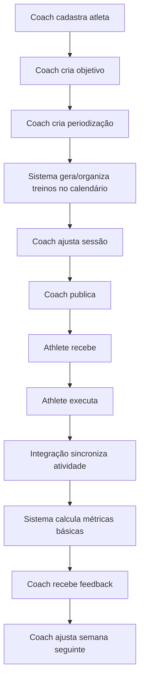

# ENKY OS v1.0 — Índice de Documentação Consolidada
**Status: Índice Operacional**

---

## 1. OBJETIVO

Este documento organiza a documentação estratégica e técnica do ENKY para orientar produto, UX, engenharia, QA, CTO e agentes de IA como Claude Code.

---

## 2. DECISÃO CENTRAL

O ENKY deve ser tratado como empresa de tecnologia com um produto principal, não como apenas um software. A documentação passa a funcionar como memória institucional e autoridade de produto/arquitetura.

---

## 3. ESTRUTURA OFICIAL DO REPOSITÓRIO

### `/docs`
Documentação executiva, estratégica e de produto. Escrita para pessoas.

### `/architecture`
Documentação técnica de engenharia. Escrita para implementação, manutenção, auditoria e evolução.

---

## 4. ORDEM OFICIAL: `/docs/enky-os`

1.  **00 — ENKY Manifesto (Constitution)**
2.  **01 — Product Vision & Scope**
3.  **02 — Architecture Principles**
4.  **03 — Product Principles**
5.  **04 — Ecosystem**
6.  **05 — Business Domain**
7.  **06 — Bounded Contexts**
8.  **07 — Ubiquitous Language**
9.  **08 — Domain Review & Gap Analysis**
10. **09 — North Star**
11. **09A — Competitive Strategy / Competitive Intelligence**
    *   *09A.1 — Competitive Intelligence: Treinus*
12. **09B — Positioning Strategy**
13. **09C — Business Model**
14. **09D — Pricing Strategy**
15. **09E — Product Strategy**
16. **10 — Product Roadmap**
17. **11 — MVP / ENKY Foundation Release**
18. **12 — Release Strategy**
19. **13 — Master PRD**
20. **PRD 13 — Design System**
21. **14 — Technical Architecture**
22. **PRD 01 — ENKY Coach**
23. **23 — Roadmap MVP para Plataforma Completa**
24. **24 — Prompt Master para Claude/Codex**

---

## 5. DOCUMENTOS TÉCNICOS PREVISTOS: `/architecture`

- `context-map.md`
- `event-storming.md`
- `sequence-diagrams.md`
- `api-contracts.md`
- `database.md`
- `rbac.md`
- `deployment.md`
- `observability.md`
- `integrations.md`
- `security.md`
- `adr/` (Architectural Decision Records)

---

## 6. DOCUMENTOS FINAIS PREVISTOS

- **`ENKY_BIBLE.md`**: Documento mestre da empresa e do produto. Primeira leitura obrigatória para qualquer novo desenvolvedor, PM, designer, QA, CTO ou IA.
- **`CLAUDE.md`**: Manual operacional do Claude Code. Não é prompt solto; é o conjunto de regras permanentes para engenharia assistida por IA.
- **`ENKY_DECISIONS.md`**: Histórico cronológico de decisões importantes: calendário como centro, TrainingSession única, Knowledge como domínio, Organization em vez de Company, marketplace separado da prescrição, IA assistiva, motores centrais etc.
- **`DESIGN_AUTHORITY.md`**: Documento de governança que define quem pode mudar arquitetura, banco, nomes de entidades, APIs, Design System e decisões estruturais.

*Regra de Design Authority:* Nenhuma IA pode alterar decisões fundamentais do ENKY por conta própria. Mudanças estruturais exigem atualização explícita da documentação aprovada e registro em ADR.

---

## 7. DECISÕES PERMANENTES JÁ ESTABELECIDAS

1.  A ENKY é uma plataforma operacional SaaS multiesporte.
2.  O treinador é o usuário prioritário.
3.  O atleta recebe simplicidade.
4.  O calendário é o centro operacional.
5.  Toda `TrainingSession` nasce no calendário.
6.  Existe apenas um editor universal de sessão.
7.  A arquitetura é orientada por domínio, não por modalidade.
8.  `Sport` e `TrainingDiscipline` devem ser conceitos separados.
9.  `Organization` é a unidade principal.
10. `User` não é `Coach` nem `Athlete`.
11. `Person` deve representar a pessoa física.
12. `Membership` liga `User`/`Person` ao contexto organizacional.
13. RBAC multi-organização é obrigatório.
14. Toda ação crítica gera `AuditLog`.
15. O marketplace é separado de prescrição.
16. O faturamento (Billing) não conhece esporte.
17. O Analytics interpreta, mas não altera dados.
18. A IA sugere, explica e revisa, mas nunca publica sozinha.
19. `Knowledge` é um domínio estratégico.
20. O `Calculation Engine` concentra fórmulas e métodos científicos.
21. As integrações funcionam como providers/adapters e não carregam regras esportivas.
22. Componentes visuais não acessam banco de dados.
23. Regras importantes rodam no servidor.
24. APIs são contratos versionados.
25. Decisões arquiteturais estruturais exigem ADR.

---

## 8. MOTORES CENTRAIS PROPOSTOS

- Calendar Engine
- Workout Engine
- Science Engine
- Analytics Engine
- AI Engine
- Marketplace Engine
- Notification Engine
- Integration Engine

---

## 9. ESTRATÉGIA E FLUXO DO MVP

*Diretriz:* Não desenvolver por telas isoladas. Desenvolver por fluxos completos.

### Fluxo Prioritário do MVP:

### O que entra no MVP:
- ENKY Coach
- ENKY Athlete
- Dashboard
- Calendário
- Workout Builder
- Biblioteca
- Gestão de atletas
- Avaliações
- Comunicação básica
- Integrações essenciais (Strava, Garmin, FIT/GPX)
- Auditoria (AuditLog)
- RBAC

### O que não entra no MVP:
- IA avançada / Assistente ativo
- Marketplace de planos
- Financeiro SaaS avançado
- CRM avançado
- White Label / Enterprise
- ENKY Academy
- API pública
- Analytics avançado
- Gamificação / Redes sociais
- Comunidade e eventos

---

## 10. MÉTRICA NORTE (NORTH STAR METRIC)

### **AUAM** — *Athletes Under Active Management*
Definição: Atletas em acompanhamento ativo nos últimos 30 dias, com treinador ativo, pelo menos uma sessão publicada e execução ou interação relevante.

---

## 11. CRITÉRIO PRÁTICO PARA CLAUDE CODE

Claude só deve implementar depois de:
1.  Ler a documentação.
2.  Confirmar entendimento.
3.  Criar/organizar docs no repositório.
4.  Auditar o projeto atual.
5.  Mapear fluxo de calendário/prescrição.
6.  Propor plano por sprints.
7.  Receber aprovação explícita.
