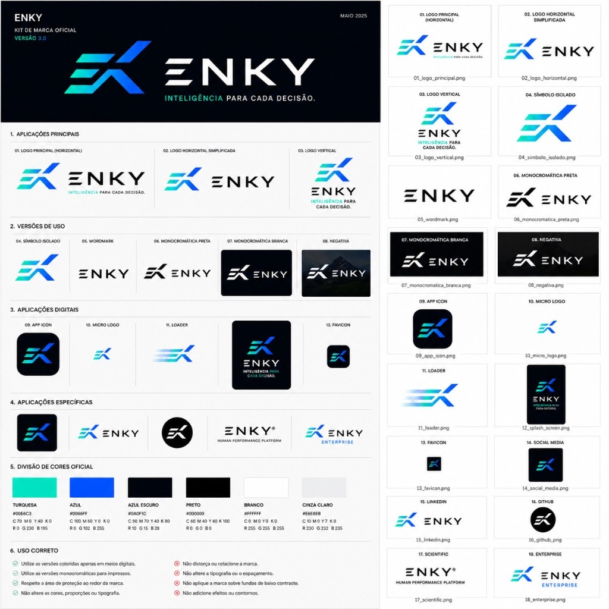

# ENKY OS — ESPECIFICAÇÃO VISUAL DE TELAS (v1.0)
**Fonte única de verdade para implementação de UI/UX, Design e Frontend**

> [!WARNING]
> **AVISO IMPORTANTE SOBRE A IDENTIDADE VISUAL:**  
> A imagem de mockup fornecida neste diretório é **apenas uma sugestão conceitual** de layout, disposição de elementos e fluxo visual das telas.  
> **A logotipo que aparece no mockup está desatualizada e errada.**  
> A marca oficial, suas variações corretas, paleta de cores institucional e tipografia estão documentadas em [brand/README.md](file:///c:/Users/pc/enky/enky/brand/README.md). Sempre utilize a logo do diretório [brand/](file:///c:/Users/pc/enky/enky/brand) para a implementação real do sistema.

---

## MOCKUP CONCEITUAL (SUGESTÃO DE INTERFACE)

Abaixo está o painel de mockups conceituais para referência visual de distribuição espacial da UI:

---

## ÍNDICE DE TELAS (MAPA DO MVP)

### 1. ÁREA PÚBLICA
* **T-01:** Home Page Institucional
* **T-02:** Marketplace de Planos (Vitrine)
* **T-03:** Login / Cadastro (Ponto de Entrada)

### 2. ÁREA DO TREINADOR (Painel Operacional)
* **T-04:** Dashboard Principal
* **T-05:** Lista e Gestão de Atletas
* **T-06:** Perfil Detalhado do Atleta (Análise & Insight)
* **T-07:** Calendário Semanal (Núcleo de Prescrição - Drag & Drop)
* **T-08:** Criador de Treino — Corrida
* **T-09:** Criador de Treino — Musculação/Funcional
* **T-10:** Revision de Feedbacks Pendentes
* **T-11:** Marketplace do Treinador (Criação & Gestão de Planos)

### 3. ÁREA DO ATLETA (Painel de Execução)
* **T-12:** Dashboard/Treino do Dia
* **T-13:** Calendário Semanal/Lista de Treinos
* **T-14:** Detalhe do Treino (Visualização de Execução)
* **T-15:** Feedback Pós-Treino (Entrada de Dados)
* **T-16:** Meus Planos (Gestão de Compras)

### 4. ÁREA ADMINISTRATIVA (Gestão da Plataforma)
* **T-17:** Dashboard Admin
* **T-18:** Gestão de Usuários e Permissões
* **T-19:** Gestão de Pagamentos e Marketplace

---

## DETALHAMENTO TÉCNICO DAS TELAS

### 1. ÁREA PÚBLICA

#### T-01: Home Page Institucional
* **Acesso:** Visitante (Público)
* **Rota:** `/`
* **Componentes:**
  * **Header:** Logo ENKY (versão horizontal simplificada oficial), Links (Sobre, Treinadores, Atletas, Marketplace, Preços), Botões (Login, Cadastro).
  * **Hero Section:** Título impactante alinhado à filosofia da marca (transformar dados em performance). CTA claro para Cadastro.
  * **Seções de Valor:** Benefícios para Treinadores (organizar caos, inteligência) e Atletas (clareza, feedback).
  * **Footer:** Links institucionais e legais.

#### T-02: Marketplace de Planos (Vitrine Pública)
* **Acesso:** Visitante (Público)
* **Rota:** `/marketplace`
* **Componentes:**
  * Header e Footer padrão.
  * **Filtros:** Modalidade, Nível (Iniciante a Avançado), Objetivo (Maratona, Força, etc.).
  * **Grade de Cards de Planos:** Imagem/Ícone, Título do Plano, Modalidade, Duração, Treinador Criador, Preço (ou "Grátis").
  * *Link para T-03 ao clicar em "Comprar".*

#### T-03: Login / Cadastro
* **Acesso:** Visitante (Público)
* **Rota:** `/login`, `/cadastro`
* **Componentes:**
  * Interface limpa, focada no formulário.
  * **Formulário de Entrada:** Email, Senha.
  * **Formulário de Cadastro:** Nome, Email, Senha (confirmar).
  * **Seleção de Papel (Se Cadastro):** "Sou Treinador", "Sou Atleta". *(Nota: Admin não se cadastra publicamente).*
  * Recuperação de Senha.

---

### 2. ÁREA DO TREINADOR

#### T-04: Dashboard Principal
* **Acesso:** TRAINER
* **Rota:** `/treinador/dashboard`
* **Objetivo:** Decisões imediatas.
* **Componentes:**
  * **Cards de Resumo (Métricas do MVP):** Atletas Ativos, Treinos de Hoje, Feedbacks Pendentes (com link para T-10), Alertas Importantes (Ex: Atletas sem treino próximo - link para T-07).
  * **Seção "Atenção Necessária":** Painel com insights da **ENKY Intelligence** (Ex: *"Atleta X relatou dor alta no treino anterior"*).
  * **Visão Geral da Semana:** Resumo visual de aderência planejada vs. realizada (gráfico simples).
  * **Atalhos de Ação:** "Cadastrar Atleta" (T-05), "Novo Treino" (T-07).

#### T-05: Lista e Gestão de Atletas
* **Acesso:** TRAINER
* **Rota:** `/treinador/atletas`
* **Componentes:**
  * **Tabela de Atletas:** Foto, Nome, Modalidade Principal, Status (Ativo, Arquivado - *Exige Confirmação*), Vínculo (Data de Início).
  * **Filtros e Busca:** Por nome ou status.
  * **Botão "Novo Atleta"** (Abre modal de cadastro básico).
  * **Ações na tabela:** Acessar Perfil (T-06), Arquivar Atleta *(Confirmação)*.

#### T-06: Perfil Detalhado do Atleta
* **Acesso:** TRAINER (Apenas para atletas vinculados)
* **Rota:** `/treinador/atletas/[id]`
* **Componentes:**
  * **Header do Atleta:** Foto, Nome, Idade, Objetivos Principais, Histórico de Vínculo.
  * **Resumo de Performance (Métricas):** Carga Semanal Atual, Aderência (%), Último Feedback (RPE/Dor).
  * **Painel ENKY Intelligence no Perfil:** Interpretação de dados (Formato padrão de insight: Observação, Interpretação, Dados Usados, Confiança, Limitação, Ação Sugerida).
  * Visualização rápida do Calendário (Últimas 2 semanas - Link para T-07).
  * **Ações:** Gerar Relatório Simples (T-13), Configurar Zonas de Treinamento (Modal - Pace, FC).

#### T-07: Calendário Semanal (Núcleo de Prescrição)
* **Acesso:** TRAINER
* **Rota:** `/treinador/calendario`
* **Objetivo:** Organização e prescrição.
* **Componentes:**
  * **Filtro de Atleta (Dropdown)** - *Obrigatório*.
  * **Visualização Semanal (Linha do Tempo):** Dias da semana (segunda a domingo) em colunas.
  * **Cards de Treino:** Modalidade (ícone/cor), Título, Carga Planejada (Volume/Duração/RPE), Status (Rascunho, Publicado, Realizado).
  * **Interações:**
    * Clique em slot vazio: Abre seletor de modalidade para novo treino *(Link para T-08 ou T-09)*.
    * Clique em Card: Abre detalhe/edição rápida (Modal).
    * **Drag & Drop:** Mover card entre dias. *(Exige persistência no banco. Se Publicado, Exige Confirmação explícita antes de mover).*
  * **Ação:** Botão "Publicar Semana" (Mudar status de todos os treinos da semana de Rascunho para Publicado).

#### T-08: Criador de Treino — Corrida
* **Acesso:** TRAINER
* **Rota:** `/treinador/treinos/novo?atleta=[id]&type=run`
* **Componentes:**
  * **Contexto:** "Atleta: [Nome]".
  * **Campos Comuns:** Data, Título, Objetivo, Descrição, Publicação (Toggle Rascunho/Publicado).
  * **Campos Específicos (Corrida):** Tipo de Treino (Rodagem, Intervalado, etc.), Distância Total Planejada (km), Duração Total Planejada (min), Pace Planejado (min/km), FC Planejada (bpm), RPE Planejado (escala 1-10), Zonas (Filtro por zona).
  * **Construtor de Blocos (Modular):**
    * Bloco A: Aquecimento (Campos).
    * Bloco B: Principal (Campos + Repetições, Distância por repetição, Intervalo).
    * Bloco C: Volta à calma (Campos).
  * **Ações:** Salvar Rascunho, Publicar, Excluir *(Confirmação)*.

#### T-09: Criador de Treino — Musculação/Funcional
* **Acesso:** TRAINER
* **Rota:** `/treinador/treinos/novo?atleta=[id]&type=strength`
* **Componentes:**
  * **Contexto:** "Atleta: [Nome]".
  * **Campos Comuns:** Data, Título, Objetivo, Descrição, Publicação.
  * **Campos Específicos (Musculação/Funcional):** Tipo de Treino (Força, Hipertrofia, Core, Preventivo, etc.).
  * **Lista de Exercícios (Modular):**
    * Linha de Exercício 1: Exercício (Busca em banco de exercícios), Séries, Repetições, Carga (kg), RPE/RIR, Intervalo. *(Capacidade de adicionar vídeo/imagem futuramente).*
    * Botão "Adicionar Exercício".
  * **Ações:** Salvar Rascunho, Publicar, Excluir *(Confirmação)*.

#### T-10: Revisão de Feedbacks Pendentes
* **Acesso:** TRAINER
* **Rota:** `/treinador/feedbacks`
* **Componentes:**
  * **Tabela de Feedbacks Aguardando Revisão:** Atleta, Treino (Título/Modalidade), Data de Realização, RPE Relatado, Dor Relatada (Local/Intensidade).
  * **Ações na tabela:** Revisar (Abre Modal com detalhe e campo de comentário do treinador).
  * **Status do Feedback:** Pendente, Revisado. *(Ao revisar, gerar log).*

#### T-11: Marketplace do Treinador (Criação & Gestão de Planos)
* **Acesso:** TRAINER
* **Rota:** `/treinador/marketplace`
* **Componentes:**
  * **Lista de Planos Criados:** Título, Modalidade, Preço, Status (Draft, Pending Review, Published, Rejected).
  * **Ações na lista:** Editar (T-08/T-09 adaptado para template), Publicar *(Muda status para Pending Review)*, Arquivar *(Muda status para Archived - Confirmação)*.
  * **Botão "Novo Plano"** (Abre T-08/T-09 adaptado para criar Template de Plano). *(Obrigatório campos de modalidade, nível, objetivo, duração, frequência, descrição, preço e aviso de responsabilidade).*

---

### 3. ÁREA DO ATLETA

#### T-12: Dashboard/Treino do Dia
* **Acesso:** ATHLETE
* **Rota:** `/atleta/dashboard`
* **Objetivo:** Clareza simples e execução.
* **Componentes:**
  * **Card Principal:** "Teu Treino de Hoje": Se houver, mostra Resumo do Treino (Modalidade, Título, Objetivo Principal) e Botão "Ver Detalhe" *(Link para T-14)*. Se não houver, mostra "Dia de Descanso" ou mensagem informativa.
  * **"Próximos Treinos":** Lista dos próximos 2-3 treinos publicados.
  * **Seção "Ação Necessária":** "Feedback Pendente" (Card destacando treino realizado sem feedback - Botão "Enviar Feedback" *(Link para T-15)*).
  * **Visão Geral da Semana (Aderência):** Barra de progresso da semana atual.

#### T-13: Calendário Semanal/Lista de Treinos
* **Acesso:** ATHLETE
* **Rota:** `/atleta/calendario`
* **Componentes:**
  * **Visualização Semanal/Lista (Apenas treinos publicados):** Data, Modalidade, Título, Status (Pendente, Realizado - com ícone de feedback enviado).
  * **Interações:**
    * Clique em Treino: Abre Detalhe do Treino *(Link para T-14)*.
  * *Nota: Atleta não pode mover treinos.*

#### T-14: Detalhe do Treino (Visualização de Execução)
* **Acesso:** ATHLETE (Apenas treinos próprios e publicados)
* **Rota:** `/atleta/treinos/[id]`
* **Componentes:**
  * **Header do Treino:** Modalidade, Título, Data.
  * **Prescrição Completa:** Fiel ao criado em T-08/T-09, mas apenas leitura.
  * **Ações:** "Enviar Feedback" (Abre T-15), "Treino Concluído" (Muda status para Realizado, se feedback não for enviado imediatamente).

#### T-15: Feedback Pós-Treino (Entrada de Dados)
* **Acesso:** ATHLETE (Apenas para treinos próprios marcados como Realizados ou Parciais)
* **Rota:** `/atleta/feedbacks/novo?treino=[id]`
* **Componentes:**
  * **Contexto:** "Treino: [Título]".
  * **Campos de Feedback (Obrigatórios MVP):**
    * **Realização:** Dropdown (Realizado Total, Parcial, Não Realizado).
    * **Duração Real** (min).
    * **Distância/Carga Real** (se aplicável à modalidade).
    * **RPE Percebido** (Escala 1-10).
    * **Fadiga Geral Percebida** (Escala 1-10).
    * **Recuperação Percebida** (Dropdown).
    * **Dor/Desconforto?** (Toggle Sim/Não). Se Sim: Local da Dor (Texto/Seletor em corpo), Intensidade da Dor (Escala 1-10).
    * **Observação/Comentário Livre.**
  * **Ações:** Enviar Feedback, Cancelar. *(Ao enviar, gerar log).*

#### T-16: Meus Planos (Gestão de Compras)
* **Acesso:** ATHLETE
* **Rota:** `/atleta/planos`
* **Componentes:**
  * **Lista de Planos Adquiridos/Comprados:** Título do Plano, Treinador, Data de Compra, Status de Pagamento (Paid, Refunded, Cancelled), Status de Acesso.
  * **Interações:** Clique no plano abre detalhe/início do plano.

---

### 4. ÁREA ADMINISTRATIVA

#### T-17: Dashboard Admin
* **Acesso:** ADMIN / SUPERADMIN
* **Rota:** `/admin/dashboard`
* **Objetivo:** Visão macro da plataforma.
* **Componentes:**
  * **Cards de Resumo:** Total de Usuários, Total de Treinadores, Total de Atletas, Vendas do Mês (Marketplace), Assinaturas Ativas, Logs de Erro.
  * **Grade de Atividade Recente:** Lista paginada de logs críticos (Ex: Cadastro de Treinador, Compra de Plano).
  * **Alertas do Sistema:** Indica problemas ou necessidades de suporte.

#### T-18: Gestão de Usuários e Permissões
* **Acesso:** ADMIN / SUPERADMIN
* **Rota:** `/admin/usuarios`
* **Componentes:**
  * **Tabela de Usuários:** Foto, Nome, Email, Papel (ADMIN, TRAINER, ATHLETE), Status (Ativo, Bloqueado), Data de Cadastro.
  * **Filtros:** Por nome, papel ou status.
  * **Ações na tabela:**
    * "Bloquear/Desbloquear Usuário" *(Exige Confirmação)*.
    * "Alterar Papel" (Mudar papéis, Ex: TRAINER para ADMIN - *Exige Confirmação e gera Log*).
    * Acessar Perfil (Visualização apenas leitura).

#### T-19: Gestão de Pagamentos e Marketplace
* **Acesso:** ADMIN / SUPERADMIN
* **Rota:** `/admin/marketplace`
* **Componentes:**
  * **Seção Marketplace (Planos):** Tabela de Planos Criados pelos Treinadores aguardando revisão. Ações: "Aprovar" *(Muda status para Published)*, "Rejeitar" *(Muda status para Rejected, exige campo de motivo - Confirmação)*.
  * **Seção Pagamentos (Transações):** Tabela de todas as transações (compras e assinaturas). Dados: ID Transação, Usuário (Nome/Email), Plano, Data, Preço, Status de Pagamento (Pending, Paid, Failed, Refunded, etc.).
  * **Ações de Pagamento:** "Reembolsar" *(Inicia processo de reembolso - Confirmação e Log)*.
